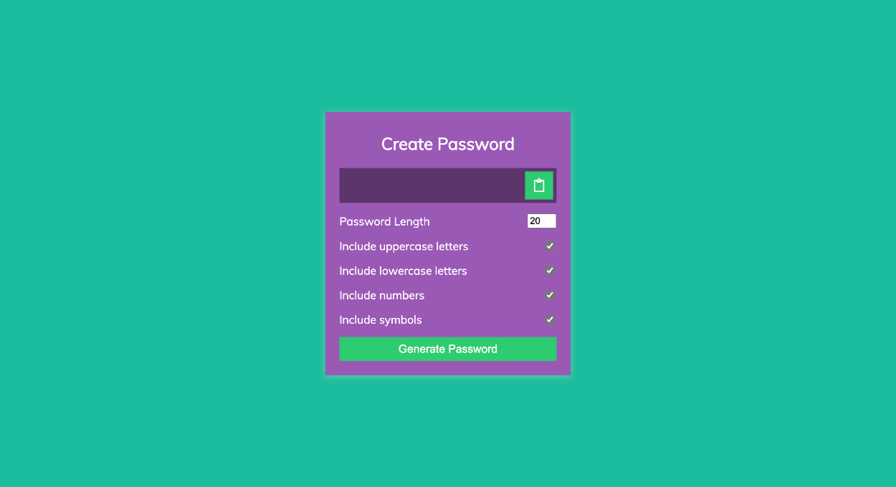

# Password generator using Javascript

- This is a Password generator application, made using HTML, CSS and Javascript
- Generates password of specified length.

## Screenshot

## Built with

- Javascript 
- Semantic HTML5 markup
- CSS custom properties
- Flexbox
- media query

## What I learned
- 
- 

## Time taken
- It took me around 3 hours to built this website from scratch.

## Links
- [live demo](https://psw-gntr.netlify.app/)
- [source](https://github.com/RAM844/Password-generator-javascript)

## Contact me
- GitHub - [@RAM844](https://github.com/RAM844)
- Twitter - [@ShriramBalaji7](https://www.twitter.com/ShriramBalaji7)

